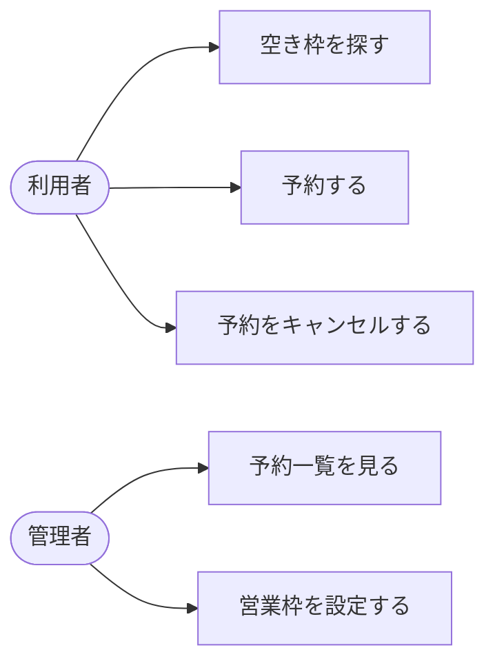

## ペルソナ

### 利用者：佐藤さん（30代・会社員）

- 平日の昼休みにスマホで予約したい
- 電話をかける時間が取れない

### 管理者：店舗スタッフ

- 当日の予約一覧をすぐに確認したい

## ユースケース

```mermaid
flowchart LR
  user([利用者]) --> UC1[空き枠を探す]
  user --> UC2[予約する]
  user --> UC3[予約をキャンセルする]
  admin([管理者]) --> UC4[予約一覧を見る]
  admin --> UC5[営業枠を設定する]
```
