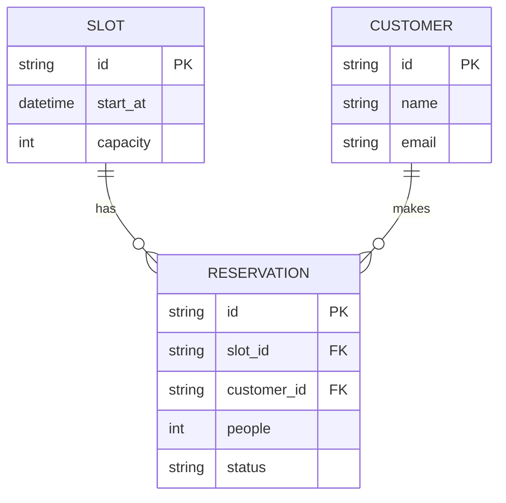

```mermaid
erDiagram
  SLOT ||--o{ RESERVATION : has
  CUSTOMER ||--o{ RESERVATION : makes
  SLOT {
    string id PK
    datetime start_at
    int capacity
  }
  RESERVATION {
    string id PK
    string slot_id FK
    string customer_id FK
    int people
    string status
  }
  CUSTOMER {
    string id PK
    string name
    string email
  }
```

## 補足

- RESERVATION.status は `confirmed` / `canceled`
