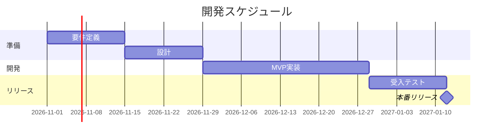

## マイルストーン

| フェーズ | 完了条件 |
| --- | --- |
| 要件確定 | 要件定義書の承認 |
| MVP | 予約・一覧の基本機能が動く |
| リリース | 受入テスト完了 |

## スケジュール

```mermaid
gantt
  dateFormat YYYY-MM-DD
  title 開発スケジュール
  section 準備
  要件定義       :a1, 2026-11-01, 14d
  設計           :a2, after a1, 14d
  section 開発
  MVP実装        :b1, after a2, 30d
  section リリース
  受入テスト     :c1, after b1, 14d
  本番リリース   :milestone, after c1, 0d
```
